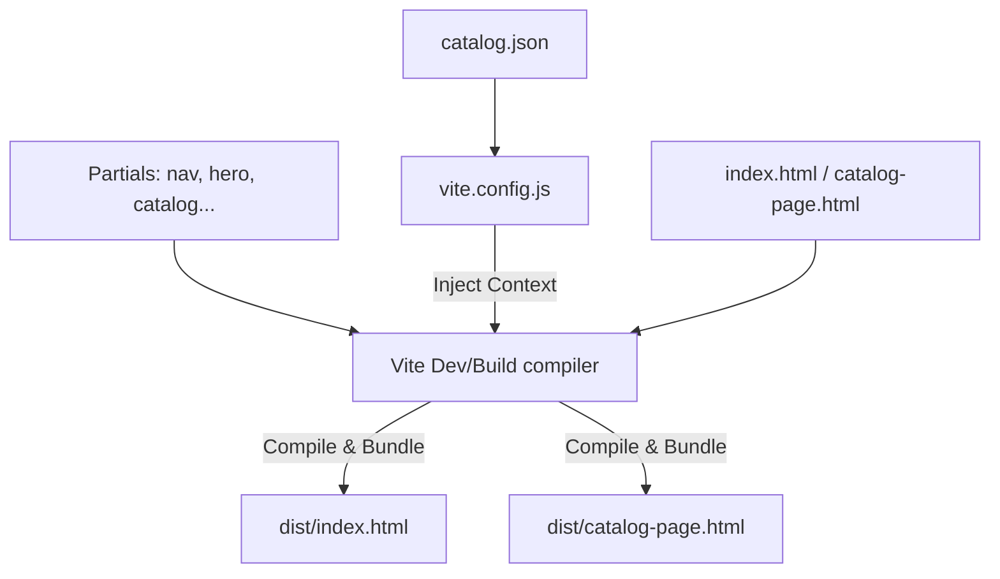

# ATOM Project Documentation

This document provides a detailed breakdown of the ATOM website codebase. It serves as a technical overview for developers collaborating on the project, detailing the architecture, folder structure, core page behaviors, and styling systems.

---

## 1. Overview & Architecture

ATOM is a premium, handcrafted planter brand based in Pune, Maharashtra. The website is a fast, responsive, single-page-first application with dedicated Catalog and Checkout flows.

### Technical Stack
*   **Core**: HTML5, Vanilla JavaScript, Vanilla CSS.
*   **Build System & Bundler**: Vite (v8.0.10) for asset compilation, hot reloading, and minification.
*   **Template Engine**: Handlebars (`vite-plugin-handlebars`) to componentize HTML files into reusable partials and dynamically inject product lists at compile-time.
*   **Database/Storage (Static)**: JSON-based catalog (`catalog.json`) loaded into the Handlebars compilation context.
*   **Hosting & Deployment**: Firebase Hosting.

### Static Compilation Flow
Instead of fetching product details client-side via APIs, ATOM uses compile-time rendering. The Vite configuration reads [catalog.json](file:///d:/ATOM%20Main/src/data/catalog.json), filters featured products, and feeds this data directly into the Handlebars context. When running a build, Vite produces optimized, fully static HTML files in the `dist` directory.



---

## 2. Directory Structure & File Hierarchy

The following tree illustrates the workspace file layout:

```text
d:\ATOM Main\
├── .firebase/                 # Local Firebase cache/hosting metadata
├── .firebaserc                # Firebase project bindings (atom-524e4)
├── .gitignore                 # Files excluded from git tracking
├── firebase.json              # Firebase Hosting configuration (targets dist/)
├── index_guide.md             # Structural outline for index.html
├── package-lock.json          # Node dependency lockfile
├── package.json               # Project scripts and dependencies
├── vite.config.js             # Vite configuration and Handlebars setup
├── public/                    # Static assets copied directly to dist/
│   └── images/                # Team photos, brand imagery, and product mockups
└── src/                       # Source files compiled by Vite
    ├── index.html             # Landing page template (uses Handlebars)
    ├── catalog-page.html      # Full catalog page template
    ├── checkout.html          # Order checkout page template
    ├── css/
    │   └── style.css          # Main stylesheet (Design tokens & layout styles)
    ├── js/
    │   └── main.js            # Frontend interactions and form logic
    ├── data/
    │   └── catalog.json       # Source database of planters and custom options
    └── partials/              # Handlebars components
        ├── about.html         # Brand pillars and values
        ├── catalog.html       # Featured picks layout
        ├── contact.html       # Contact info and WhatsApp form
        ├── corporate.html     # Corporate gifting services
        ├── earthy.html        # Decorative visual divider strip
        ├── footer.html        # Global footer
        ├── hero.html          # Welcome screen & quick metrics
        ├── marquee.html       # Infinite ticker animation
        ├── nav.html           # Header navbar
        ├── process.html       # Process/how it is built
        ├── product-card.html  # Reusable product catalog item
        └── team.html          # Team founding members grid
```

### Key Configurations
*   [package.json](file:///d:/ATOM%20Main/package.json): Defines dependencies (`vite`, `vite-plugin-handlebars`) and task commands (`npm run dev` to start Vite, `npm run build` to compile client files).
*   [vite.config.js](file:///d:/ATOM%20Main/vite.config.js): Customizes compilation. Configures `src` as root, sets input entry points (`main`, `catalog`, `checkout`), and initializes the handlebars plugin with templates from `src/partials/`.
*   [firebase.json](file:///d:/ATOM%20Main/firebase.json): Configures Firebase Hosting to serve assets from the `dist` folder.
*   [.gitignore](file:///d:/ATOM%20Main/.gitignore): Safely ignores local node dependencies, environment settings, local logs, and deprecated root assets, while keeping `src/index.html` tracked.

---

## 3. Core Pages & Template Flow

### Landing Page: [index.html](file:///d:/ATOM%20Main/src/index.html)
The home page is built sequentially by combining multiple HTML partials inside the document body:

1.  **[nav.html](file:///d:/ATOM%20Main/src/partials/nav.html)**: Logo, menu links (About, Catalog, Our Process, Corporate Gifts, Enquire). Includes a hamburger menu button visible on smaller viewports.
2.  **[hero.html](file:///d:/ATOM%20Main/src/partials/hero.html)**: Top introduction. Headline *"Design Your Calm Space"*, background image from [hero1.png](file:///d:/ATOM%20Main/src/hero1.png), metrics overlay (25+ Designs, 100% Handcrafted, Custom), and CTA links.
3.  **[marquee.html](file:///d:/ATOM%20Main/src/partials/marquee.html)**: Scrolling ribbon showcasing brand mottos (e.g., *Sustainably Made*, *Personality Over Pattern*).
4.  **[about.html](file:///d:/ATOM%20Main/src/partials/about.html)**: Founders' vision and three core pillars: **Premium Aesthetics**, **Emotional Resonance**, and **Implicit Sustainability**.
5.  **[earthy.html](file:///d:/ATOM%20Main/src/partials/earthy.html)**: A visual separator displaying an earthy-themed banner with the tagline *"Living decor that grows with you."*
6.  **[catalog.html](file:///d:/ATOM%20Main/src/partials/catalog.html)**: Renders a section showcasing only products flagged as `featured: true` in the JSON data.
7.  **[process.html](file:///d:/ATOM%20Main/src/partials/process.html)**: Step-by-step description of the planter creation process: Design, Mould, Print, Quality.
8.  **[corporate.html](file:///d:/ATOM%20Main/src/partials/corporate.html)**: Promotional section for bulk B2B and institutional orders (Custom branding, bulk fulfillment).
9.  **[team.html](file:///d:/ATOM%20Main/src/partials/team.html)**: Founder and partners profile cards (Atharv Jagtap, Kaushal Pawar, Ayush Chavan).
10. **[contact.html](file:///d:/ATOM%20Main/src/partials/contact.html)**: Contains details (Phone, Instagram, Location) and a request form.
11. **[footer.html](file:///d:/ATOM%20Main/src/partials/footer.html)**: Bottom copyright message and social link back.

### Full Catalog Page: [catalog-page.html](file:///d:/ATOM%20Main/src/catalog-page.html)
A dedicated page accessed from the navbar. Displays the complete collection.
*   **Category Tabs**: Buttons that allow filtering products by categories: *Anime*, *Desi/Hindi*, *Love & Aesthetic*, *Pop Culture*, *Nature & Art*, and *Custom*.
*   **Dynamic Loop**: Iterates through the entire array of products in `catalogProducts.full` and renders them utilizing the [product-card.html](file:///d:/ATOM%20Main/src/partials/product-card.html) partial.

### Checkout Page: [checkout.html](file:///d:/ATOM%20Main/src/checkout.html)
Handles ordering items. This page does not require a database backend; it extracts product details on the fly.
*   **Query Parameters**: Pulls `product`, `img`, and `price` parameters from the page URL (e.g. `/checkout.html?product=Bhukkad&img=/images/Bhukkad 1.png&price=749`).
*   **Dynamic Binding**: Automatically populates the selected planter name, price, and thumbnail image dynamically.
*   **Forms**: Collects Name, Delivery Address, Quantity, and Design Type.
*   **Order Completion**: Redirects the user directly to WhatsApp with a pre-formatted message carrying the order details, total cost, and delivery address.

---

## 4. Data Model

All product information is structured inside [catalog.json](file:///d:/ATOM%20Main/src/data/catalog.json). The catalog array contains objects matching the following schema:

| Field | Type | Description |
| :--- | :--- | :--- |
| `id` | String | Unique identifier (e.g. `desi-bhukkad`, `anime-gojo`) |
| `cat` | String | Technical category filter name (`desi`, `love`, `popcult`, `nature`, `anime`, `custom`) |
| `badge` | String | Short category badge text displayed on the product card image |
| `displayCat` | String | Human-readable category title |
| `name` | String | Name of the design |
| `desc` | String | Description of the design |
| `img` | String | Path relative to public folder (e.g. `/images/Bhukkad 1.png`) |
| `featured` | Boolean| If `true`, the product is shown in the "Featured Picks" section of the main landing page |
| `price` | Number | Product cost in INR (universally priced at 749) |

---

## 5. Styling & Interaction Systems

### Styling: [style.css](file:///d:/ATOM%20Main/src/css/style.css)
ATOM uses a curated color scheme and typeface configuration:
*   **Design Tokens (`:root`)**:
    *   Colors: Warm cream background (`#EDE8DF`), deep dark charcoal text (`#2C2B28`), wine burgundy (`#8B1A2F`) for accents, and soft sand/gold accents (`#C8B99A`).
    *   Typography: Display headings use *DM Serif Display*, elegant serif annotations use *Cormorant Garamond*, and clean body copy uses *DM Sans*.
*   **Noise Overlay**: A subtle grain texture is applied over the viewport using an inline SVG noise filter in `body::after`.
*   **Animations**:
    *   Infinite horizontal scrolling (`@keyframes marquee`) for the banner.
    *   Scroll reveal effects (`.reveal` and `.reveal.in-view` combined with transition delays `d1`, `d2`, `d3`, `d4`).
*   **Breakpoints**: Clean media queries targeting tablet (`@media(max-width:1024px)`) and mobile devices (`@media(max-width:640px)`) adjusting grids from 3-columns down to a single column.

### Client-side Scripts: [main.js](file:///d:/ATOM%20Main/src/js/main.js)
Controls interactive functionality:
*   **Smooth Scroll (`goTo`)**: Locates element IDs and scrolls smoothly via `scrollIntoView`. If triggered from another page (e.g. the catalog page), it first redirects to the home anchor `/#[id]`.
*   **Header Shrink**: Listens to page scroll events and adds a `.scrolled` utility class to decrease navbar padding when the user scrolls past 40px.
*   **Reveal on Scroll**: Instantiates an `IntersectionObserver` observing all elements with the `.reveal` class, toggling the `.in-view` class to slide and fade items into view.
*   **Category Filtering**: Hooks click listeners to `.tab-btn` elements, toggling `.visible` classes on catalog items depending on whether their `data-cat` attribute matches the active tab's filter.
*   **Enquiry Form redirection**: Validates name, phone, enquiry type, and details. Then, it creates a WhatsApp URL:
    ```javascript
    const whatsappURL = "https://wa.me/" + targetNumber + "?text=" + whatsappMessage;
    window.open(whatsappURL, '_blank').focus();
    ```
*   **Buy Now Button**: Redirects users to `checkout.html` with query strings prepopulated, linking items to the checkout page.

---

## 6. Deployment Guide

The website is set up to deploy directly to Firebase Hosting.

### Deployment Process
1.  **Build production code**: Runs the Vite compiler, outputting production assets into the [dist](file:///d:/ATOM%20Main/dist) directory.
    ```bash
    npm run build
    ```
2.  **Deploy using Firebase CLI**: Uploads the `dist` folder to Firebase.
    ```bash
    firebase deploy
    ```
    *The site binds to the Firebase App ID `atom-524e4` as configured in the project settings.*
